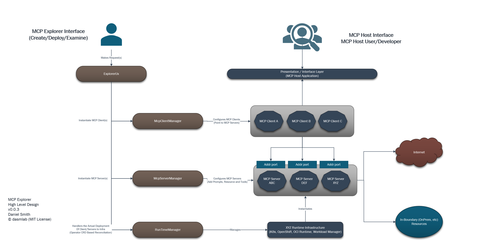
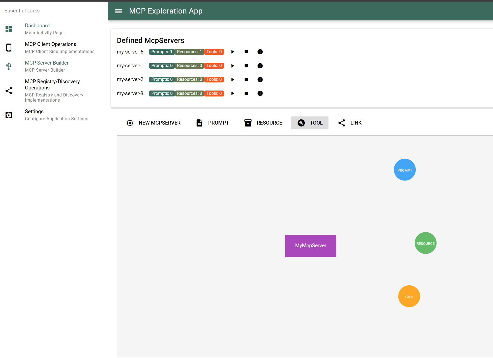
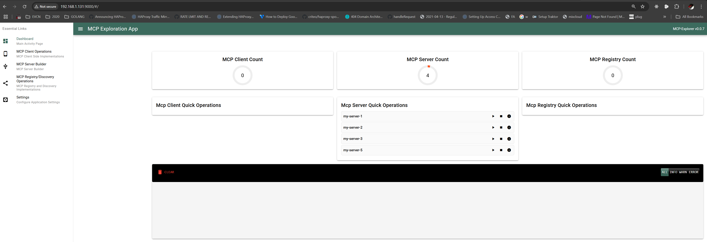

# MCP Tour

> A Tour of the Model Context Protocol (MCP) using a Go-based implementation.

---

**NOTE:**  
This project builds on top of MCP's early concepts, including a Go-based SDK.  
Please consult the `LICENSES/` directory for full license attributions (MIT/BSD) for Google and Anthropic work.

---

## � Goal

To experiment with the under-development MCP Go SDK and learn more about MCP’s structure and implementation patterns.

This project also serves as a boilerplate and sandbox to explore roadmap concepts from the official MCP homepage.

This allows a user to author MCP Clients, MCP Servers as well as orchestrate the desired infrastructure to run them on (docker, k8s, serverless) 

---

## 🗂 Project Layout

- `client_app/` – Go-based MCP client that connects to an MCP server and interacts using the protocol.
- `server_app/` – Go-based MCP server that handles requests from clients, optionally routes to LLMs or external services.
- `explorer_ux/` â~@~S Vue.js (argon/bootstrap) UX interface for Authoring MCP Clients, MCP Servers and infrastructure to deploy your MCPs on.
- `mcp_src/` – Sourced from [googlesource.com/tools/internal/mcp](https://go.googlesource.com/tools/internal/mcp), adjusted for standalone use.

---

## 🚀 How to Use

1. Clone the repository.
2. Build the following components:
   - `server_app`
   - `client_app`
   - `registry_app`
   - `explorer_ux`
3. Run all four applications.

### Application Endpoints

Adjust for your IP or hostname:

- **Explorer UX** → `https://<your-ip>:9000/`
- **Server Manager** → `https://<your-ip>:10010/swagger/index.html`
- **Client Manager** → `https://<your-ip>:10011/swagger/index.html`
- **Registry Manager** → `https://<your-ip>:10012/swagger/index.html`

---

## 📚 External Libraries

The `mcp_src/` directory includes code from Google's internal toolchain (`googlesource.com/tools/internal`).

Modifications were limited to import paths and minimal compatibility updates.  
All original licensing headers and notices have been preserved.

Please see the `LICENSES/` directory for full BSD/MIT license details for all third-party inclusions.

---

## � Resources

- [Architecture Overview (PPT)](resources/mcp-tour-architecture.pptx)
